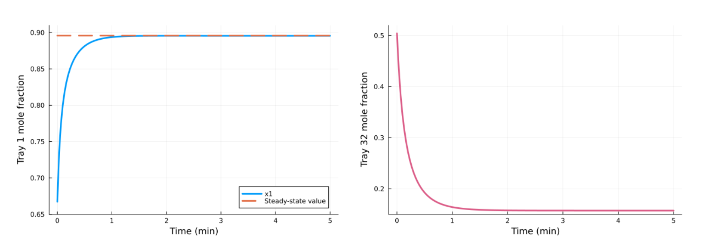
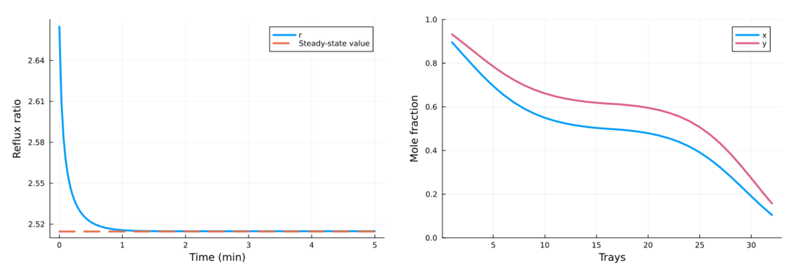
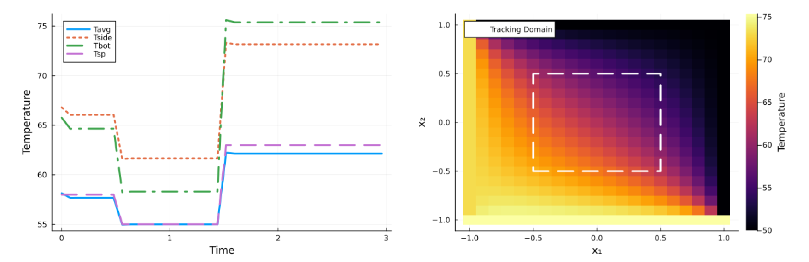

# GPU-Accelerated Direct Transcription-Based Nonlinear Model Predictive Control
This repository contains the source code used for the case studies 
presented in the manuscript "GPU-Accelerated Direct Transcription-Based Nonlinear Model Predictive Control" by Evelyn Gondosiswanto and Joshua L. Pulsipher. Note that running the GPU benchmarks require an NVIDIA GPU with CUDA support.

## Building the repository
```bash
git clone --recursive https://github.com/infiniteopt/GPU-NMPC-paper
cd GPU-NMPC-paper
mkdir -p \
    distillation/logs \
    pde/logs \
    results/{Ipopt,MOI,ExaModelsCPU,ExaModelsGPU,MPCGPU}
```

## Running the Julia Benchmarks
First, you'll need to install Julia (available at https://julialang.org/downloads/). Then to configure the required packages, create and instantiate a Julia environment using the `Project.toml` file as follows:
```julia
julia> ]

(@v1.12) pkg> activate .

(GPU-NMPC-paper) pkg> instantiate
```

The `JuMP.jl` and `InfiniteExaModels.jl` benchmarks are run using the `run_cases_nmpc.jl` file. 

## Case Study 1: Optimal Control of a Distillation Column
The source code for this case study is contained in:
- `distillation.jl` (`JuMP.jl` and `InfiniteExaModels.jl`)
- `distill-OptimalControl.jl` (`OptimalControl.jl`)





## Case Study 2: Temperature Control of a PDE Heated Plate
The source code for this case study is contained in `pde.jl`.



## Running the MPCGPU Distillation Benchmark
The source code for this case study is contained in the `distillation/mpcgpu` subfolder. As this GPU-based case study is written in CUDA C/C++, you will need to install CUDA Toolkit (see https://developer.nvidia.com/cuda-toolkit-archive) and a compatible C++ compiler.

To build and compile the code from the root directory, run the following command:
```bash
nvcc -std=c++17 \
    distillation/mpcgpu/distillation_pcg.cu \
    -Idistillation/mpcgpu \
    -IMPCGPU/include \
    -IMPCGPU/include/common \
    -IMPCGPU/include/dynamics \
    -IMPCGPU/include/pcg \
    -IMPCGPU/GLASS \
    -IMPCGPU/GLASS/include \
    -IMPCGPU/GBD-PCG \
    -IMPCGPU/GBD-PCG/include \
    -lcublas \
    -o distillation_pcg
```

Then the case study itself can be run using:
```bash
./distillation_pcg
```
The benchmark results are written to their respective folders in the `results` subfolder.